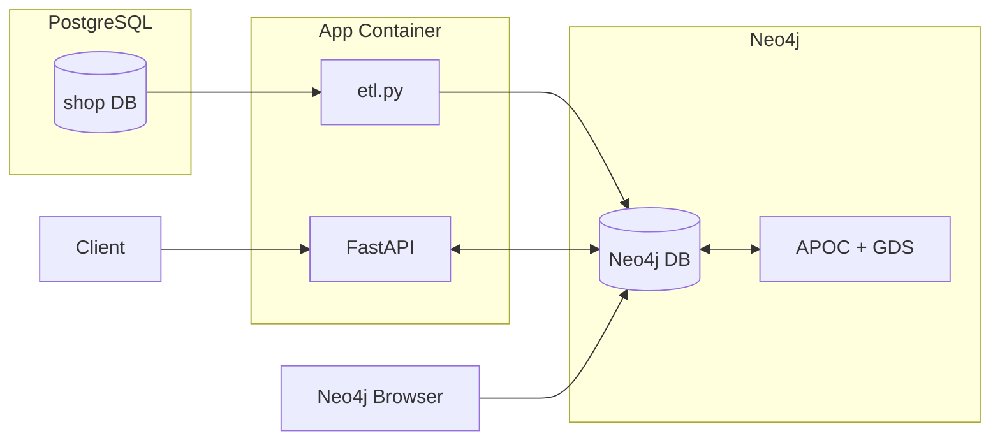

# E-Commerce Graph Recommendation Engine

A production-ready e-commerce recommendation system using **PostgreSQL**, **Neo4j**, and **FastAPI**. This project demonstrates real-world data architecture patterns for building graph-based recommendation engines.

## 📋 Table of Contents

- [Overview](#overview)
- [Architecture](#architecture)
- [Features](#features)
- [Prerequisites](#prerequisites)
- [Quick Start](#quick-start)
- [Project Structure](#project-structure)
- [Usage](#usage)
- [API Endpoints](#api-endpoints)
- [Testing](#testing)
- [Recommendation Strategies](#recommendation-strategies)
- [Production Improvements](#production-improvements)
- [Troubleshooting](#troubleshooting)

## 🎯 Overview

This project implements a **realistic e-commerce recommendation engine** that mirrors production use cases in many companies. It demonstrates:

- **Data Migration**: ETL pipeline from relational (PostgreSQL) to graph database (Neo4j)
- **Graph Analytics**: Leveraging graph algorithms for recommendations
- **API Layer**: RESTful API built with FastAPI for easy integration
- **Containerization**: Fully dockerized stack for easy deployment

## 🏗 Architecture



### Data Flow

1. **PostgreSQL** stores transactional e-commerce data (customers, orders, products)
2. **ETL Process** (`etl.py`) transforms relational data into graph structure
3. **Neo4j** powers graph analytics with APOC and Graph Data Science (GDS) plugins
4. **FastAPI** exposes recommendation endpoints to clients

## ✨ Features

### Implemented Recommendation Strategies

- **Collaborative Filtering**: Recommendations based on similar customers' purchases
- **Product Similarity**: Co-occurrence analysis (frequently bought together)
- **Category-Based**: Popular products within categories
- **Trending Products**: Based on user interactions (views, clicks, add-to-cart)

### Technical Features

- ✅ Dockerized multi-container architecture
- ✅ Automated database initialization
- ✅ Health checks and monitoring
- ✅ Automated testing suite
- ✅ Graph schema with constraints and indexes
- ✅ Batch processing for large datasets
- ✅ Connection retry logic for resilience

## 📦 Prerequisites

Before you begin, ensure you have:

- **Docker Desktop** installed and running
- **4 GB free RAM** for Neo4j + GDS plugin
- **Available ports**:
  - `5432` (PostgreSQL)
  - `7474` & `7687` (Neo4j)
  - `8000` (FastAPI)

### System Requirements

- OS: Windows, macOS, or Linux
- Docker Engine: 20.10+
- Docker Compose: 2.0+

## 🚀 Quick Start

### 1. Clone the Repository

```bash
git clone https://github.com/Alain-Rostomyan/Graph-Knowledge-TP2.git
cd Graph-Knowledge-TP2
```

### 2. Start the Stack

```bash
docker compose up -d
```

This will start three services:
- **postgres**: Database with e-commerce data
- **neo4j**: Graph database with APOC and GDS plugins
- **app**: FastAPI application server

### 3. Verify Services are Running

```bash
docker compose ps
```

Expected output:
```
NAME        IMAGE              STATUS
postgres    postgres:16        Up (healthy)
neo4j       neo4j:5.20         Up (healthy)
app         python:3.11-slim   Up (healthy)
```

### 4. Run the ETL Process

```bash
docker compose exec -it app python etl.py
```

This will:
- Extract data from PostgreSQL
- Transform relational data to graph structure
- Load data into Neo4j with relationships

### 5. Test the API

```bash
curl http://localhost:8000/health
```

Expected response:
```json
{"ok": true}
```

## 📁 Project Structure

```
.
├── docker-compose.yml          # Multi-container orchestration
├── README.md                   # This file
├── postgres/
│   └── init/
│       ├── 01_schema.sql       # Database schema
│       └── 02_seed.sql         # Sample data
├── neo4j/
│   ├── data/                   # Neo4j persisted data
│   └── import/                 # CSV import directory
├── app/
│   ├── main.py                 # FastAPI application
│   ├── etl.py                  # ETL pipeline
│   ├── queries.cypher          # Neo4j schema setup
│   ├── start.sh                # Startup script
│   └── requirements.txt        # Python dependencies
└── scripts/
    └── check_containers.sh     # Automated testing
```

## 💻 Usage

### Access Neo4j Browser

1. Open [http://localhost:7474](http://localhost:7474)
2. Login with:
   - Username: `neo4j`
   - Password: `password`

### Explore the Graph

Run these Cypher queries in Neo4j Browser:

```cypher
// Count all nodes
MATCH (c:Customer) RETURN count(c) AS customers;
MATCH (p:Product) RETURN count(p) AS products;
MATCH (o:Order) RETURN count(o) AS orders;

// View customer orders
MATCH (c:Customer)-[:PLACED]->(o:Order)-[:CONTAINS]->(p:Product)
RETURN c.name, o.id, collect(p.name) AS products;

// Find product co-occurrences
MATCH (p1:Product)<-[:CONTAINS]-(o:Order)-[:CONTAINS]->(p2:Product)
WHERE p1 <> p2
RETURN p1.name, p2.name, count(*) AS times_bought_together
ORDER BY times_bought_together DESC;
```

## 🔌 API Endpoints

### Health & Stats

- `GET /` - API information
- `GET /health` - Health check
- `GET /stats` - Graph statistics

### Recommendations

- `GET /recs/collaborative/{customer_id}` - Collaborative filtering
- `GET /recs/similar/{product_id}` - Similar products
- `GET /recs/category/{category_id}` - Category-based
- `GET /recs/trending` - Trending products

### Data Exploration

- `GET /customers` - List all customers
- `GET /products` - List all products

### Example API Calls

```bash
# Get health status
curl http://localhost:8000/health

# Get graph statistics
curl http://localhost:8000/stats

# Get collaborative recommendations for customer C1
curl http://localhost:8000/recs/collaborative/C1

# Get similar products to P1
curl http://localhost:8000/recs/similar/P1

# Get trending products
curl http://localhost:8000/recs/trending

# List all customers
curl http://localhost:8000/customers
```

## 🧪 Testing

### Manual Testing Script

```bash
# On Windows (PowerShell)
bash scripts/check_containers.sh

# On Unix/Linux/macOS
chmod +x scripts/check_containers.sh
bash scripts/check_containers.sh
```

### Automated Testing with Docker

```bash
docker compose run --rm checks
```

This runs comprehensive tests:
- ✅ FastAPI health check
- ✅ PostgreSQL connectivity
- ✅ Sample SQL queries
- ✅ ETL execution

### Verify PostgreSQL Data

```bash
# Check schema
docker compose exec -T postgres psql -U app -d shop -c "\dt"

# Count records
docker compose exec -T postgres psql -U app -d shop -c "SELECT count(*) FROM customers;"
docker compose exec -T postgres psql -U app -d shop -c "SELECT count(*) FROM orders;"
docker compose exec -T postgres psql -U app -d shop -c "SELECT count(*) FROM events;"
```

## 🎯 Recommendation Strategies

### 1. Collaborative Filtering

**Strategy**: Find customers who bought similar products, then recommend what they purchased that the target customer hasn't bought yet.

**Use Case**: "Customers who bought items similar to yours also bought..."

**Algorithm**:
1. Find customers with overlapping purchases
2. Rank by number of common products
3. Recommend their unique purchases

### 2. Product Similarity (Co-occurrence)

**Strategy**: Analyze which products are frequently purchased together.

**Use Case**: "Frequently bought together"

**Algorithm**:
1. Find orders containing the target product
2. Count co-occurring products
3. Return highest co-occurrence scores

### 3. Category-Based Recommendations

**Strategy**: Popular products within a category, ranked by order frequency.

**Use Case**: "Popular in [Category]"

**Algorithm**:
1. Filter products by category
2. Count orders per product
3. Return top-ordered products

### 4. Trending Products

**Strategy**: Products with most user interactions (views, clicks, add-to-cart).

**Use Case**: "What's trending now"

**Algorithm**:
1. Count all interaction events
2. Aggregate by product
3. Return highest interaction counts

## 🚀 Production Improvements

To transform this into production-ready code:

### 1. Scalability

- **Load Balancing**: Add multiple FastAPI instances behind a load balancer
- **Database Replication**: PostgreSQL read replicas for ETL queries
- **Neo4j Clustering**: Deploy Neo4j in cluster mode for high availability
- **Caching**: Implement Redis for frequently accessed recommendations

### 2. Data Management

- **Incremental ETL**: Only process changed data instead of full reload
- **Scheduling**: Use Apache Airflow or similar for ETL orchestration
- **Data Validation**: Add data quality checks and monitoring
- **Versioning**: Track data lineage and model versions

### 3. Performance

- **Query Optimization**: Create additional indexes based on query patterns
- **Batch Processing**: Process large datasets in parallel
- **Connection Pooling**: Reuse database connections
- **API Response Caching**: Cache recommendation results with TTL

### 4. Reliability

- **Circuit Breakers**: Handle downstream service failures gracefully
- **Retry Logic**: Exponential backoff for transient failures
- **Health Checks**: Comprehensive monitoring and alerting
- **Graceful Degradation**: Fallback recommendations when graph is unavailable

### 5. Security

- **Authentication**: Implement OAuth2/JWT for API access
- **Authorization**: Role-based access control (RBAC)
- **Secrets Management**: Use Vault or AWS Secrets Manager
- **Network Segmentation**: Isolate databases in private subnets
- **Encryption**: TLS for all connections, encryption at rest

### 6. Observability

- **Logging**: Structured logging with correlation IDs
- **Metrics**: Prometheus/Grafana for monitoring
- **Tracing**: Distributed tracing with Jaeger/Zipkin
- **Alerting**: PagerDuty/Opsgenie integration

### 7. Testing

- **Unit Tests**: Comprehensive test coverage
- **Integration Tests**: End-to-end testing
- **Load Tests**: Performance testing with k6/Locust
- **Chaos Engineering**: Test resilience with failure injection

### 8. ML Enhancements

- **Personalization**: User-specific weighting factors
- **A/B Testing**: Compare recommendation strategies
- **Feedback Loop**: Learn from user interactions
- **Graph Embeddings**: Use GDS node embeddings for similarity
- **Real-time Updates**: Stream events for instant recommendations

## 🔧 Troubleshooting

### Services Won't Start

```bash
# Check service status
docker compose ps

# View logs
docker compose logs -f app
docker compose logs -f neo4j
docker compose logs -f postgres

# Restart services
docker compose restart
```

### Port Already in Use

```bash
# Find process using port (Windows PowerShell)
Get-NetTCPConnection -LocalPort 8000

# Kill process
Stop-Process -Id <PID> -Force
```

### Neo4j Out of Memory

Increase heap size in `docker-compose.yml`:

```yaml
NEO4J_server_memory_heap_max__size: 4G
NEO4J_server_memory_heap_initial__size: 2G
```

### ETL Fails

```bash
# Re-run ETL with fresh start
docker compose exec -it app python etl.py

# Check PostgreSQL data
docker compose exec -T postgres psql -U app -d shop -c "SELECT count(*) FROM orders;"

# Check Neo4j connectivity
docker compose exec -it app python -c "from neo4j import GraphDatabase; driver = GraphDatabase.driver('bolt://neo4j:7687', auth=('neo4j', 'password')); driver.verify_connectivity(); print('OK')"
```

### Full Reset

```bash
# Warning: This deletes all data
docker compose down -v
rm -rf neo4j/data

# Restart
docker compose up -d
docker compose exec -it app python etl.py
```

## 📊 Dataset

The sample dataset includes:

- **3 Customers**: Alice, Bob, Chloé
- **4 Products**: Wireless Mouse, USB-C Hub, Graph Databases Book, Mechanical Keyboard
- **2 Categories**: Electronics, Books
- **3 Orders**: With multiple order items
- **5 Events**: User interactions (views, clicks, add-to-cart)

This minimal dataset demonstrates all features while keeping the project lightweight.

## 🤝 Contributing

This is an academic project. For improvements or issues, please create an issue in the repository.

## 📄 License

This project is created for educational purposes as part of the ESSEC & CentraleSupélec Graph Theory course.

## 🙏 Acknowledgments

- Course: Graph Theory TP2
- Institution: ESSEC & CentraleSupélec
- Technologies: PostgreSQL, Neo4j, FastAPI, Docker

---

**Happy Graph Mining! 🔥🤗**
